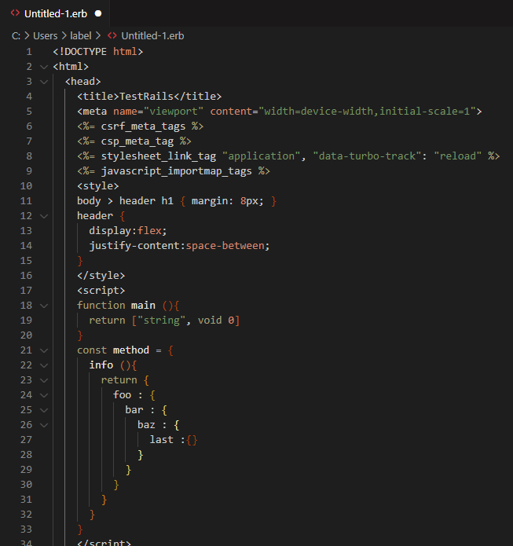

# TextBird Theme for VSCode

The TextBird theme for VSCode is inspired by TextMate's simplicity and elegance. This theme is designed to give you the benefits of TextMate's highlighting features and keybindings on VSCode. With restrained colors, this theme ensures a clean and straightforward visual experience that enhances readability and reduces visual noise.

## Features
- **Highlighting**: Borrowing from TextMate, we've made sure to apply a similar highlighting scheme that promotes readability.
- **Keybindings**: Some keybindings are designed to mimic TextMate. Be aware, some may behave differently than expected.
- **Simple and Clear Color Scheme**: The color scheme of the theme is kept restrained and minimalist. This provides a straightforward and focused experience when coding.

## Installation
To install this theme, copy the root folder of this project to your `~/.vscode/extensions` directory.

## Notice
Please note, this theme is not officially distributed on the marketplace and there are currently no plans for such distribution.

